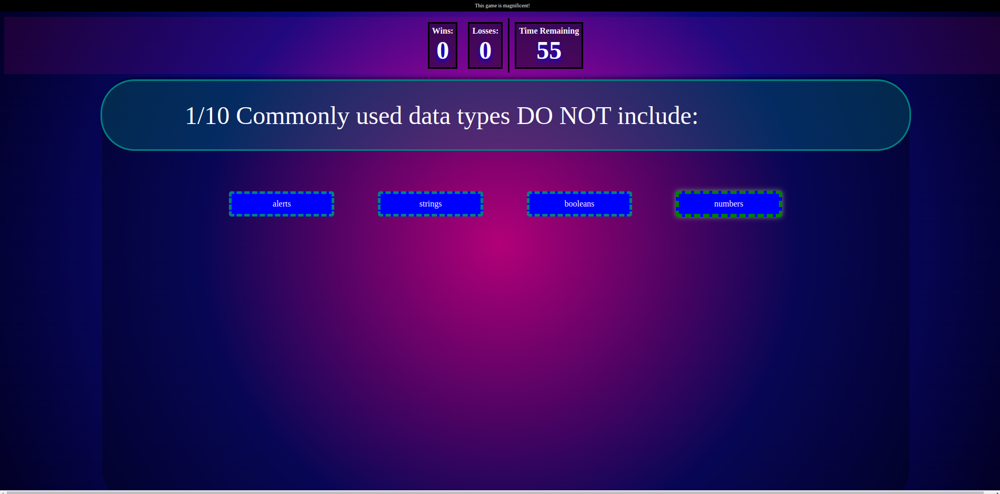

# quiz-o-matic

## Task

 this Challenge invites you to build a timed coding quiz with multiple-choice questions. This app will run in the browser and will feature dynamically updated HTML and CSS powered by JavaScript code that you write. It will have a clean, polished, and responsive user interface. 

## Usage

Load the page, [available here](https://omgthegreenranger.github.io/quiz-o-matic/)  and click the "Start Game" button. See if you can answer the questions before time runs out!

Here is an image of the quiz in action!

In any case, the scores you rack up will be stored in local storage.

*Note: Event Delegation was a lesson this week, however I found a script to do so on line 193 from https://davidwalsh.name/event-delegate*

*Note 2: to randomize the question order, I found a variation of the Durstenfeld shuffle and modified for my own needs. This was found somewhere on Stackoverflow.*

Full repository is at https://github.com/omgthegreenranger/quiz-o-matic